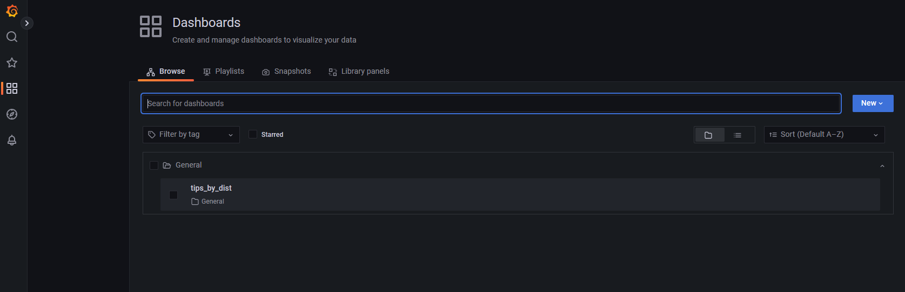
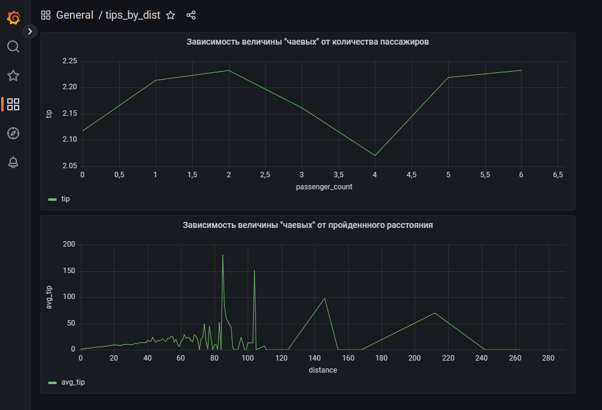

<br/>
<p align="center">
  <a href="https://github.com/kkolyagin">
    
  </a>

  <h3 align="center">Итоговая задача 5  курса "Инженер данных"</h3>

</p>


## Содержание

* [О проекте](#О-проекте)
* [Используемое ПО](#Используемое-ПО)
* [С чего начать](#С-чего-начать)
  * [Требования](#Требования)
  * [Установка](#Установка)
* [Описание](#Описание)
* [Результаты](#Результаты)
## О проекте

Проект № 5.

**Служба такси.**
Все операции должны считаться локально.
Есть таблица, состоящая из поездок такси в Нью-Йорке:

|Поле | Описание|
|-----|:-------|
VendorId | ИД компании
Trep_pickup_datetime |Время и дата, когда пассажир сел в такси
Trep_dropoff_datetime |Время и дата, когда пассажир вышел из такси
Passanger_count | Количество пассажиров
Trip_distance |Пройденное расстояние
Ratecodeid |Код скорости
Store_and_fwd_flag | Флаг, отвечающий за сохранение записи поездки перед ее отправкой поставщику
PulocationId | Широта, где была начата поездка
Dolocationid | Долгота, где была начата поездка
Payment_type | Тип оплаты
Fare_amount | Стоимость поездки
Mta_tax | Комиссия автопарка
Tip_amount | Чаевые
Tools_amount | Оплата за платные дороги
Improvement_surchange | Доплата за страховку
Total_amount | Полная стоимость поездки
Congestion_surchange | Дополнительный сбор 

**Источник:** https://disk.yandex.ru/d/DKeoopbGH1Ttuw

Необходимо, используя таблицу поездок для каждого дня рассчитать процент поездок по количеству человек в машине (без пассажиров, 1, 2,3,4 и более пассажиров). По итогу должна получиться таблица (parquet) с колонками date, percentage_zero, percentage_1p, percentage_2p, percentage_3p, percentage_4p_plus. Технологический стек – sql,scala (что-то одно).
Также добавить столбцы к предыдущим результатам с самой дорогой и самой дешевой поездкой для каждой группы.

Дополнительно: также провести аналитику и построить график на тему “как пройденное расстояние и количество пассажиров влияет на чаевые” в любом удобном инструменте.

## Используемое ПО

docker-compose (https://docs.docker.com/desktop/install/windows-install/)  
postres 15  
grafana 9.3.2 (https://github.com/grafana/grafana/blob/main/CHANGELOG.md)  
IntelliJ IDEA 2022.2.3 (https://www.jetbrains.com/idea/)  


## С чего начать

Скопировать все папки в отдельный каталог
git clone https://github.com/kkolyagin/Task5.git

*Назначение основных файлов и папок:*
|Папка/файл|Описание|
|----------|--------|
.\inp\yellow_tripdata_2020-01.csv|файл для загрузки в БД. скачать https://disk.yandex.ru/d/DKeoopbGH1Ttuw
.\postgres_grafana|папка докера с Postgres и Grafana
.\postgres_grafana\datasources\init.sql|SQL скрипт создания таблиц yellow_tripdata, parquet в Postgres
.\postgres_grafana\datasources\postgres.yml|создает источник данных Postgres в Grafana 
.\postgres_grafana\environment\.tsenv|логин и пароль для Postgres
~~.\postgres_grafana\environment\.gfenv~~|логин и пароль для Grafana для хранения базы самой Grafana в Postgres (не используется)
.\src\main\scala\App.scala|исходный файл на Scala

### Требования

Для ОС Windows установить:
docker-compose (https://docs.docker.com/desktop/install/windows-install/)
IntelliJ IDEA 2022.2.3 (https://www.jetbrains.com/idea/)

### Установка

1. Скопировать все папки в отдельный каталог.  
Например склонировав репозиторий:  
```sh
 git clone https://github.com/kkolyagin/Task5.git
```
2. Из каталога \postgres_grafana запустить:  

```sh
docker-compose up -d
```

3. Создать каталог inp и поместить туда файл из https://disk.yandex.ru/d/DKeoopbGH1Ttu

4. Запустить IntelliJ IDEA, открыть проект и запустить на исполение 

5. Подключиться в Grafana http://localhost:3000/login  
логин: аdmin   
пароль по-умолчанию: admin (при входе попросит сменить. Менял на 111111qQ)

6. Посмотреть графики в Dashboard (думаю что конфигурация сохранилась в каталоге postgres_grafana\grafana\)


## Описание

При запуске docker-compose создаются пустые таблицы Postgres:  
yellow_tripdata - исходная таблица, в которую будем грузить csv-файл  
parquet - таблица с результатом работы программы  
(структура таблиц в файле postgres_grafana\datasources\init.sql)

При запуске программы на исполение последовательно запускаются 3 процедуры:  
* ReadCSV //Загрузка файла "yellow_tripdata_2020-01.csv" в таблицу БД  
* MakeParquet //Создание витрины и сохранение с перезаписью в таблицу БД  "public.parquet"  
* ShowParquet //Вывод на экран таблицы БД  "public.parquet"  

ReadCSV запустится только если таблица yellow_tripdata пустая. Если в таблице есть хоть одна запись, то загрузка выполняться не будет, программа продолжит выполнение на существующих данных  
Сделал специально, так как процедура загрузки выполняется очень долго (около часа).
Оптимизировать пока не удалось. Поэтому таблицу можно загрузить из CSV другим способом, например с использованием DBeaver https://dbeaver.io/

## Результаты

В Grafana выводится 2 графика:

**Зависимость величины "чаевых" от количества пассажиров** считалась по выборке:  
select passenger_count, avg(tip_amount) as tip, count(tip_amount) as trip_count
	from yellow_tripdata yt	
	group by passenger_count
	having count(tip_amount) >100000  

**Зависимость величины "чаевых" от пройденонного расстояния** считалась по выборке:  
SELECT round(CAST(trip_distance as numeric), 0) as distance,  
	round( CAST(avg(tip_amount) as numeric), 0) as avg_tip  
	from yellow_tripdata  
	where trip_distance > 0   
	group by distance  
	
По графикам делаю вывод что колличество "чаевых" линейно зависит от расстояния (в пределах поездок до 60)
А "чаевые" в зависимости от количества пассажиров наиболее высокие для 1,2 пассажиров и при количестве больше 4, что вероятно связано с другим более вместительным видом транспорта и более длительными поездками. (данное предположение с помощью Grafana на данный момент проверить не успел. Возможно даже удобнее было бы это сделать с помощью  matplotlib на python)